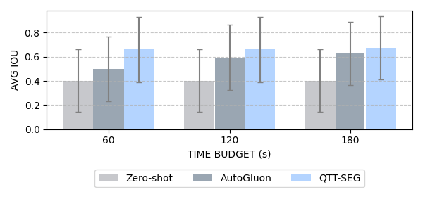
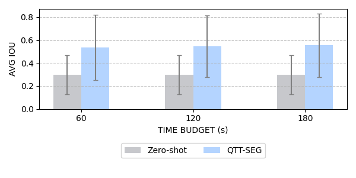

# 🧪 QuickTune Tool for Image Segmentation (QTT-SEG)

QTT-SEG adapts the **[Quicktune Tool (QTT)](https://github.com/automl/quicktunetool)** for efficient hyperparameter optimization in **image segmentation**. It uses meta-learned predictors to estimate model performance and fine-tuning cost, enabling faster finetuning of foundation models like **[SAM](https://github.com/automl/quicktunetool](https://segment-anything.com/))** .

---

## 📦 Installation & Setup

```bash
# Download the ZIP from the anonymous link and extract it:
# https://anonymous.4open.science/r/QTT-SEG-30BE/

cd QTT-SEG-30BE

# Create and activate environment
conda create -n qtt_seg python=3.11 -y
conda activate qtt_seg

# Install required packages
pip install -r requirements.txt

# Install SAM2 from source
mkdir third_party && cd third_party
git clone https://github.com/facebookresearch/sam2.git && cd sam2
pip install -e .
cd ../..
```

---

## 🧾 Step 1: Download and Prepare Dataset Splits

Before tuning, prepare the dataset CSV files (*_train.csv, *_test.csv) containing image-mask pairs.
Use the helper script below (example uses the [Forest Aerial Images for Segmentation Dataset](https://www.kaggle.com/datasets/quadeer15sh/augmented-forest-segmentation?select=Forest+Segmented):

```bash
# Download dataset via KaggleHub
python -m src.utils.download_dataset_kaggle \
  --dataset_slug quadeer15sh/augmented-forest-segmentation \
  --cache_dir .

# Generate matching image-mask dataframes
python -m src.utils.make_image_mask_dataframe \
  --images ./datasets/quadeer15sh/.../images \
  --masks ./datasets/quadeer15sh/.../masks \
  --name forest
```
This script:
- Downloads the dataset using KaggleHub
- Matches images and masks by ID
- Splits into train/test sets
- Saves CSVs in `dataframes`:
  - `forest_train.csv`
  - `forest_test.csv`

 > ⚠️ Adjust the `--images` and `--masks` paths to match your dataset's folder structure printed after download.

---

## 🚀 Step 2: Run QuickTune for Segmentation

```bash
python main.py \
  --dataset_name forest \
  --time_budget 60 \
  --output_dir ./QTT_results \
  --train_predictors \
  --setup_configs 128
```
---

## 📊 Outputs
After running the pipeline, the following directories and files will be created under the specified `--output_dir` (e.g., `./QTT_results`):

```text
QTT_results/
├── results.csv                    # Final performance results
├── PerfPredictor/                 # Trained performance predictor
├── CostPredictor/                 # Trained cost predictor
└── logs/
    └── <dataset>_<budget>/       # Logs scoped to dataset and time budget
        ├── qtt_history_logs/     # Tuning trajectory logs
        ├── config_checkpoints/   # Configuration checkpoints
        ├── opt/                  # Optimizer state logs
        └── tuner/                # Tuner-specific logs
```

Each experiment records:
- ✅ The best configuration found within the time budget
- 📈 The final test IoU score
- 🕒 Full tuning trajectory and runtime
- 💾 Checkpoints for cost and performance predictors

---

## 📈 Visual Results
Performance over Time Budgets: Mean IoU (bars) and std. (error bars) of Zero-shot, AG, and QTT-SEG across all binary and multiclass segmentation tasks. QTT-SEG shows consistent gains with longer budgets. _Note: AG (Autogluon-Multimodal) is evaluated only on binary tasks due to unclear multiclass support_.

### Binary Datasets Performance


### Multiclass Datasets Performance


---

## 🤝 Contributing
Currently, this repository is under restricted access and contributions via pull requests are not yet enabled.

If you are interested in contributing or collaborating on this project, please consider the following options:
- **Watch this space**: The repository will be made public soon, and contribution guidelines will be added at that time.
Thank you for your interest and support!
